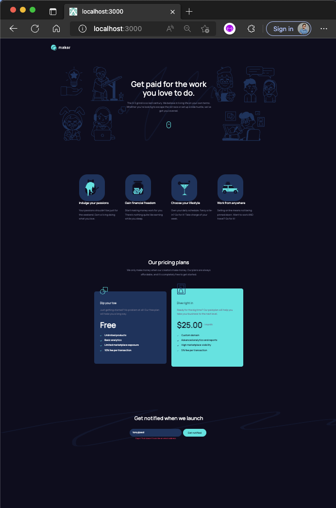

# Frontend Challenge - Maker pre-launch landing page solution

## Table of contents

- [Overview](#overview)
  - [The challenge](#the-challenge)
  - [Screenshot](#screenshot)
  - [Links](#links)
- [My process](#my-process)
  - [Built with](#built-with)
  - [What I learned](#what-i-learned)
  - [Continued development](#continued-development)
  - [Useful resources](#useful-resources)
- [Author](#author)
- [Acknowledgments](#acknowledgments)


## Overview

### The challenge

Users should be able to:

- View the optimal layout depending on their device's screen size
- See hover states for interactive elements
- Receive an error message when the form is submitted if:
  - The `Email address` field is empty should show "Oops! Please add your email"
  - The email is not formatted correctly should show "Oops! That doesn’t look like an email address"

### Screenshot




### Links

- Live Site URL: TBA

## My process

### Built with

- [Vue3](https://vuejs.org/) - Javascript framework
- [NuxtJS](https://nuxtjs.org/) - Vue framework
- [Tailwind CSS](https://tailwindcss.com/) - For styles


### What I learned

First time using Vue and Nuxt. Started from scratch! 


## Author

- Tony Alcast - [@tonyalcast](https://www.youtube.com/channel/UC9I45tVGtrFqyTOxCARG-hg)
- LinkedIn - [Antony](https://www.linkedin.com/in/tony-alcast/)


## Run it locally!

```
yarn nuxt dev
```